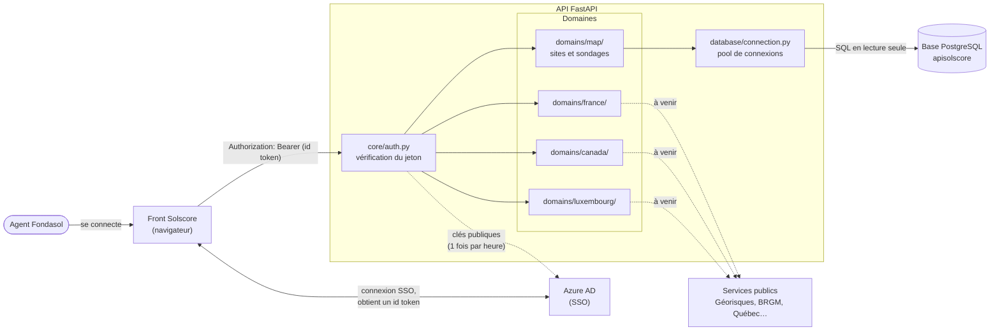
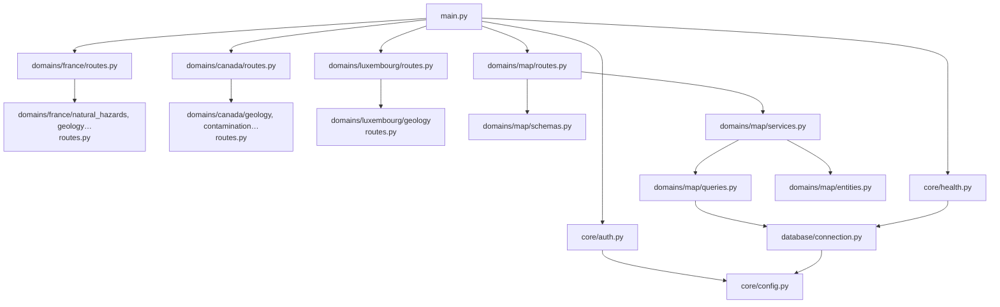
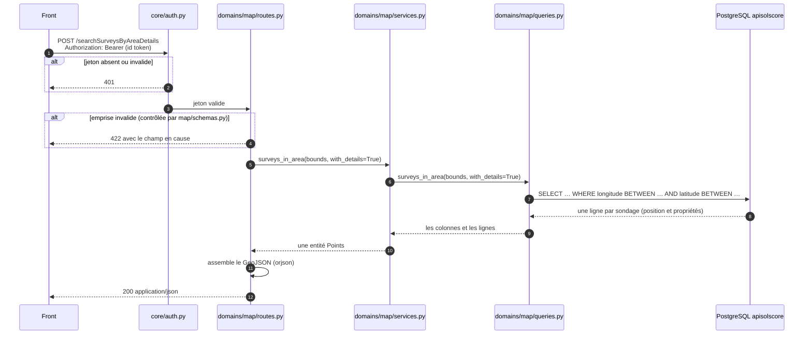

# Architecture de l'API Solscore

Ce document explique comment l'API est construite, comment le code est rangé et
comment le faire évoluer. Il s'adresse à toute personne qui doit lire ou modifier le
code, sans prérequis en architecture logicielle.

Ce projet sert de **modèle** pour structurer l'API apisolscore : il pose l'organisation
du code, la sécurité et les conventions.

---

## 1. Ce que fait l'API

L'API rend deux types de services au front Solscore :

- **les données internes de Fondasol** : les sites et les sondages à afficher sur la
  carte, lus directement dans la base PostgreSQL d'apisolscore (`app/domains/map/`, déjà en
  place) ;
- **les données d'enquête par pays** : aléas naturels, géologie, environnement…,
  obtenues auprès de services publics (Géorisques, BRGM, données du Québec…). Leur
  structure est prête dans `app/domains/france/`, `app/domains/canada/` et `app/domains/luxembourg/` ; les routes
  restent à y ajouter.

Chaque appel doit porter le jeton de l'utilisateur connecté au front par SSO (Azure AD).

| Technologie | Rôle |
|---|---|
| **FastAPI** | le framework web : routes, validation des requêtes, documentation `/docs` |
| **Pydantic** | la description et le contrôle des données reçues et renvoyées, et de la configuration |
| **SQLAlchemy + psycopg** | la connexion à PostgreSQL et l'exécution du SQL |
| **PyJWT + httpx** | la vérification du jeton Azure |
| **Uvicorn** | le serveur qui fait tourner l'application |
| **Docker Compose** | le lancement en local |

---

## 2. Vue d'ensemble



**À retenir :**
- Le front obtient un **id token** auprès d'Azure au moment de la connexion SSO, puis
  l'envoie à chaque appel dans l'en-tête `Authorization`.
- Tous les domaines passent par la même vérification du jeton.
- `map/` lit la base de Fondasol. Les domaines par pays interrogeront des services
  publics ; les flèches en pointillé sont à venir.

---

## 3. Organisation du code

```
back-fastapi/
├── app/
│   ├── main.py                          crée l'application et branche les domaines
│   ├── core/                            technique, partagé par tous les domaines
│   │   ├── config.py                    lit et vérifie la configuration (.env)
│   │   ├── auth.py                      vérification du jeton (Azure et jeton de dev)
│   │   └── health.py                    sonde /api/health
│   ├── database/                        accès à la base, partagé par tous les domaines
│   │   └── connection.py                connexion à la base d'apisolscore
│   └── domains/                         métier
│       ├── map/                         données Fondasol : sites et sondages (tous pays)
│       │   ├── routes.py
│       │   ├── schemas.py
│       │   ├── services.py
│       │   ├── entities.py
│       │   └── queries.py
│       ├── france/                      données d'enquête France          → /fr/…
│       │   ├── routes.py                regroupe les thèmes de la France
│       │   ├── natural_hazards/         aléas naturels                    → /fr/natural-hazards/…
│       │   ├── geology/
│       │   ├── urban_planning/          PLU, PPR
│       │   ├── environment/             sites pollués, zones naturelles, CatNat, cavités…
│       │   ├── hydrogeology/            BSS, ADES
│       │   └── weather/
│       ├── canada/                      données d'enquête Canada          → /ca/…
│       │   ├── routes.py
│       │   ├── geology/
│       │   ├── contamination/           GTC, FCSI, sites contaminés…
│       │   ├── environment/             milieux naturels, faune, eau…
│       │   └── infrastructure/          pipelines, RBQ, NPRI
│       └── luxembourg/                  données d'enquête Luxembourg      → /lu/…
│           ├── routes.py
│           └── geology/
├── tests/                               même arborescence que app/
├── docs/
│   └── architecture.md                  ce document
├── Dockerfile
├── docker-compose.yml
├── pyproject.toml                       dépendances Python
├── .env.example                         modèle de configuration (versionné)
└── .env                                 configuration réelle (non versionnée)
```

**Trois dossiers, trois rôles :**
- `app/core/` : le **technique**, partagé par tous (configuration, sécurité, sonde). On
  y touche rarement.
- `app/database/` : la **connexion à la base** d'apisolscore, utilisée par les domaines
  qui lisent la base. On y touche rarement aussi.
- `app/domains/` : le **métier**. C'est là qu'on ajoute les fonctionnalités.

Chaque thème contient déjà tous les fichiers du modèle (voir plus bas). Ils sont vides,
avec une ligne de commentaire qui dit à quoi ils servent, sauf `routes.py`, qui déclare
le routeur du thème avec son préfixe d'URL et son étiquette dans `/docs` :

```python
from fastapi import APIRouter

router = APIRouter(prefix="/natural-hazards", tags=["France - Natural hazards"])
```

Ces routeurs sont déjà branchés : une route ajoutée dans un thème est aussitôt disponible
et protégée. Les thèmes sans route n'apparaissent pas encore dans `/docs`.

### Le principe : découper là où le code est vraiment différent

Le code est rangé **par sujet métier**, pas par type de fichier technique. Pour
comprendre ou modifier une fonctionnalité, on ouvre un seul dossier.

**Premier niveau : le pays**, pour les données d'enquête. D'un pays à l'autre, tout
change : les sources (Géorisques en France, le Géoportail au Luxembourg, les registres
du Québec), les concepts (PPR et ZNIEFF sont français, NPRI et RBQ sont canadiens), et
même la forme des réponses pour un thème commun comme la géologie. Il n'y a presque rien
à partager entre pays.

**Second niveau : le thème métier**, à l'intérieur de chaque pays : aléas naturels,
géologie, environnement… Sans lui, `france/` deviendrait un fourre-tout de 18 routes.

**Exception : `map/`**, qui n'est pas découpé par pays. Ce sont les données internes de
Fondasol : un sondage reste un sondage, qu'il soit en France ou au Canada.

### Ce qu'on trouve dans un domaine

Chaque thème suit **toujours la même structure** :

```
canada/contamination/
├── routes.py      HTTP
├── schemas.py     contrat de l'API (Pydantic)
├── services.py    logique métier, algorithmes
├── entities.py    objets métier manipulés par les algorithmes
├── sources.py     données des services externes
└── queries.py     données de la base (SQL)
```

| Fichier | Contient | Ne contient pas |
|---|---|---|
| `routes.py` | les routes : URL, lecture de la requête, appel du service, conversion du résultat en réponse | de SQL, d'appel HTTP direct, de calcul métier |
| `schemas.py` | le contrat de l'API : forme des données reçues et renvoyées, et leurs contrôles (Pydantic) | d'accès aux données, de calcul |
| `services.py` | la logique métier et les algorithmes : règles, calculs, croisement de sources | de notion HTTP (requête, statut, `Response`) |
| `entities.py` | les objets métier manipulés par les algorithmes (dataclasses) : `ContaminatedSite`, `RiskScore`… | de modèle de table, de notion HTTP |
| `sources.py` | les appels aux services externes, une fonction par appel | de mise en forme de la réponse de l'API |
| `queries.py` | le SQL, une fonction par requête, avec des paramètres `:nom` | de notion HTTP |

`sources.py` et `queries.py` font le même travail, ramener les données, depuis deux
origines différentes. Les deux sont présents dans chaque thème. Quand on écrit la
première route, on supprime celui qui ne sert pas.

**`schemas.py` ou `entities.py` ?** `schemas.py` décrit ce que voit le front ;
`entities.py` décrit ce que manipulent les algorithmes. Les services travaillent sur les
entités, et seules les routes convertissent vers les schémas. On peut ainsi faire
évoluer un algorithme sans changer la réponse de l'API, et inversement.

`map/` suit la même structure, sans `sources.py` puisque ses données viennent de la
base. C'est l'exemple complet à suivre : `routes.py` appelle `services.py`, qui appelle
`queries.py` et renvoie une entité `Points` (définie dans `entities.py`) ; la route la
convertit en GeoJSON. Son service est simple, car la carte ne fait que lire et renvoyer ;
c'est lui qui accueillera un éventuel regroupement des points ou un tri par proximité.

**Le sens des appels est toujours le même :**

```
routes.py  →  services.py  →  sources.py / queries.py
   HTTP         métier            données
```

Aucun fichier n'appelle « vers le haut » : `sources.py` ne connaît pas le service, le
service ne connaît pas la route.

**Les algorithmes sont des fonctions pures.** Le service fait deux choses : il récupère
les données (via `sources.py` ou `queries.py`), puis il appelle les fonctions de calcul
en leur passant ces données. Une fonction de calcul reçoit des données et renvoie un
résultat, sans accès à la base, au réseau ni à HTTP. On peut alors la tester avec un
petit jeu de données écrit à la main, sans base ni connexion, comme une fonction de
notebook :

```python
# services.py
def contamination_risk(latitude: float, longitude: float) -> RiskLevel:
    sites = sources.contaminated_sites_near(latitude, longitude)   # 1. les données
    return risk_level(sites, latitude, longitude)                  # 2. le calcul

def risk_level(sites: list[ContaminatedSite], latitude: float, longitude: float) -> RiskLevel:
    ...  # calcul pur : testable avec une liste de sites inventée

# ContaminatedSite et RiskLevel sont définis dans entities.py
```

**Un fichier par responsabilité, un dossier quand ça grossit.** Tant qu'un thème reste
lisible, chaque responsabilité tient dans un fichier. Quand un fichier devient trop gros,
il devient un dossier du même nom, sans changer la logique :

```
canada/contamination/
├── routes.py
├── schemas.py
├── services.py
├── entities.py
├── algorithms/          quand les calculs deviennent nombreux
│   ├── risk_score.py
│   └── proximity.py
└── sources/             quand les services externes se multiplient
    ├── gtc.py
    └── fcsi.py
```

**Pas de `repositories/`** : `sources.py` et `queries.py` jouent déjà ce rôle.

**Pas de `models.py` dans les thèmes.** Par convention, `models.py` désigne les modèles
SQLAlchemy, c'est-à-dire la description des tables. Une table n'appartient pas à un
thème : `site` ou `sondage` servent à `map/` et pourront servir à d'autres thèmes. Si on
décrit un jour les tables en modèles SQLAlchemy, ils iront dans `app/database/models.py`,
à côté de la connexion. Ce n'est pas utile aujourd'hui : la base apisolscore est lue en
lecture seule, sans migrations, et le SQL de `queries.py` est plus rapide et plus lisible.
Ces modèles deviendront utiles le jour où l'API écrira dans une base qui lui appartient.

### Les URL suivent les dossiers

| Dossier | URL |
|---|---|
| `app/domains/map/` | à la racine, pour garder le contrat actuel du front : `/searchSitesByArea`… |
| `app/domains/france/natural_hazards/` | `/fr/natural-hazards/…` |
| `app/domains/canada/contamination/` | `/ca/contamination/…` |
| `app/domains/luxembourg/geology/` | `/lu/geology/…` |

Conventions : code pays ISO (`fr`, `ca`, `lu`), noms en anglais, mots séparés par des
tirets dans les URL et par des soulignés dans les noms de dossiers.

Le code est écrit **en anglais** (dossiers, fichiers, fonctions, variables) ; seule la
documentation est en français.

### Qui dépend de qui



La règle : **un domaine peut utiliser `core/` et `database/`, eux n'utilisent jamais
un domaine**, et un pays n'utilise jamais un autre pays. C'est ce qui permet de faire
évoluer la France sans risquer de casser le Canada.

`main.py` connaît les pays ; chaque `routes.py` de pays connaît ses thèmes. Personne
d'autre n'a besoin de connaître la liste complète.

---

## 4. Le parcours d'une requête

Exemple : le front affiche les sondages d'un quartier de Paris.



1. **CORS** : si l'appel vient d'un navigateur, l'origine du front doit être dans
   `CORS_ORIGINS`.
2. **Authentification** : `core/auth.py` vérifie le jeton avant même que la route
   soit appelée.
3. **Validation** : FastAPI contrôle la requête avec le `schemas.py` du domaine. Une
   requête invalide est refusée (422) **avant** tout accès aux données.
4. **Métier** : `services.py` récupère les données et applique la logique métier.
5. **Données** : `queries.py` interroge la base (ou `sources.py` un service externe).
6. **Réponse** : `routes.py` convertit le résultat du service et le renvoie.

---

## 5. Authentification

Toutes les routes métier exigent un jeton. Seule `/api/health` est publique, ainsi que
`/docs` et la redirection de `/` vers `/docs`.

La protection est posée **une seule fois par pays ou domaine**, dans `main.py` :

```python
protected = [Depends(current_user)]

app.include_router(map_router, dependencies=protected)
app.include_router(france_router, dependencies=protected)
```

Une route ajoutée dans n'importe quel thème est donc protégée automatiquement.

### Le jeton Azure (utilisation normale)

Le front envoie l'**id token** obtenu à la connexion SSO. `core/auth.py` vérifie :

| Contrôle | Ce qui est vérifié |
|---|---|
| Signature | le jeton a bien été signé par Azure (algorithme RS256, clés publiées par le tenant) |
| Émetteur | `iss` correspond à `OIDC_ISSUER` (notre tenant Azure) |
| Audience | `aud` correspond à `OIDC_AUDIENCE` (notre application) |
| Expiration | le jeton n'est pas expiré (durée de vie : environ une heure) |
| Identité | le jeton contient `preferred_username` (l'adresse de l'agent) |

Si un seul contrôle échoue, l'API répond **401**.

### Le jeton de développement

Pour travailler en local sans aller chercher un id token, un jeton fixe peut être défini
dans le `.env` :

```dotenv
APP_ENV=dev
AUTH_DEV_TOKEN=<au moins 32 caractères, par exemple : openssl rand -hex 32>
AUTH_DEV_USER=dev@fondasol.fr
```

Garde-fous :
- il n'est accepté que si `APP_ENV=dev` ;
- s'il est défini avec une autre valeur d'`APP_ENV`, **l'API refuse de démarrer** ;
- il doit faire au moins 32 caractères ;
- il est comparé en temps constant, pour qu'on ne puisse pas le deviner caractère par
  caractère ;
- les jetons Azure restent acceptés en même temps.

> Ne jamais le définir sur un serveur partagé : quiconque le connaît accède à l'API
> sans passer par Azure.

---

## 6. Base de données

| Table | Colonnes utilisées par `map/` |
|---|---|
| `public.site` | `uuid`, `latitude`, `longitude`, `affaire_id` |
| `public.affaire` | `id`, `numero`, `nom` |
| `public.sondage` | `id`, `nom`, `site_uuid`, `localisation_longitude_xwgs84`, `localisation_latitude_ywgs84`, `has_mesure_pressiometrique` |

- **La base renvoie des lignes simples, l'API assemble le GeoJSON.** Chaque requête
  renvoie une ligne par point : `longitude`, `latitude` (déjà arrondies à 6 décimales),
  puis les propriétés, dont les noms de colonnes sont ceux attendus dans le JSON
  (`AS affaire_numero`…). Les requêtes sont construites par `points_sql()`
  (`map/queries.py`). Le service les enveloppe dans une seule entité `Points` (noms des
  propriétés et lignes), sans créer d'objet par point. `_geojson()` (`map/routes.py`)
  les met ensuite au format GeoJSON avec
  `orjson`, une bibliothèque de sérialisation JSON très rapide. Les lignes sont lues
  telles quelles (des tuples) et associées aux noms des colonnes, sans être converties
  une à une en dictionnaires.

  Ce sont deux choix de performance mesurés sur 26 000 sondages, en alternant les appels
  entre deux versions au même moment, pour un contenu identique :

  | Version | Temps de réponse |
  |---|---|
  | JSON construit par PostgreSQL (`json_build_object`, `json_agg`) | 0,63 s |
  | Lignes simples, converties en dictionnaires, JSON assemblé par l'API | 0,37 s |
  | Lignes simples lues comme tuples, JSON assemblé par l'API (actuel) | **0,29 s** |

  Construire le JSON dans PostgreSQL occupait un seul cœur de la base pendant environ
  200 ms, et produisait un texte 10 % plus gros à faire transiter depuis la base distante.

  **Contrainte à respecter** : dans `points_sql()`, `longitude` et `latitude` doivent
  rester les deux premières colonnes. `_geojson()` s'appuie sur leur position.

  Pour ajouter une propriété à une route, il suffit d'ajouter une colonne avec le bon nom
  (`AS nom_dans_le_json`) dans `SITE_PROPERTIES` ou `SURVEY_PROPERTIES`.
- **Le SQL est toujours paramétré** : les valeurs reçues du front passent par des
  paramètres (`:minLng`, `:maxLat`…), jamais par concaténation. Les f-strings de
  `queries.py` n'assemblent que des morceaux de SQL écrits dans le code. Aucune injection
  SQL n'est possible.
- **Pool de connexions** : la base est distante (environ 100 ms pour ouvrir une
  connexion). `database/connection.py` garde jusqu'à 5 connexions ouvertes (15 en pic) et
  les réutilise. Une connexion coupée est détectée et remplacée automatiquement.

---

## 7. Contrat des routes

La documentation interactive de toutes les routes est disponible sur
`http://localhost:8082/docs`.

| Route | Renvoie |
|---|---|
| `POST /searchSitesByArea` | les sites de l'emprise, positions seules |
| `POST /searchSitesByAreaDetails` | les sites, avec `uuid`, `affaire_id`, `affaire_numero`, `affaire_nom` |
| `POST /searchSurveysByArea` | les sondages de l'emprise, positions seules |
| `POST /searchSurveysByAreaDetails` | les sondages, avec `id`, `nom`, `site_uuid`, `has_mesure_pressiometrique` |
| `GET /api/health` | l'état de la connexion à la base (publique) |

**Requête :**

```json
{
  "bounds": { "minLat": 48.84, "maxLat": 48.87, "minLng": 2.33, "maxLng": 2.37 }
}
```

**Réponse** (GeoJSON) :

```json
{
  "type": "FeatureCollection",
  "features": [
    {
      "type": "Feature",
      "geometry": { "type": "Point", "coordinates": [2.343687, 48.866989] },
      "properties": {
        "id": "3848579c-…",
        "nom": "IP.17.0170_TM6",
        "site_uuid": "5784351d-…",
        "has_mesure_pressiometrique": false
      }
    }
  ]
}
```

- Les coordonnées sont dans l'ordre GeoJSON : **longitude puis latitude**, arrondies à
  6 décimales (environ 11 cm).
- `has_mesure_pressiometrique` vaut toujours `true` ou `false`, jamais `null`.
- Une zone sans donnée renvoie une collection vide, pas une erreur.

**Erreurs :**

| Statut | Cause |
|---|---|
| 401 | jeton absent, invalide ou expiré |
| 422 | requête invalide ; la réponse nomme le champ en cause |
| 503 | `/api/health` uniquement : base injoignable |

---

## 8. Configuration

Toute la configuration est lue au démarrage par `core/config.py`, depuis le fichier
`.env` (ou depuis les variables d'environnement, qui ont priorité : c'est ce qu'on
utilisera en production). **Une valeur manquante ou mal formée empêche le
démarrage**, avec un message qui nomme la variable en cause.

| Variable | Obligatoire | Rôle |
|---|---|---|
| `DB_SOLSCORE_HOST` | oui | adresse de la base d'apisolscore |
| `DB_SOLSCORE_PORT` | non (5432) | port de la base |
| `DB_SOLSCORE_NAME` | oui | nom de la base |
| `DB_SOLSCORE_USER` | oui | utilisateur de la base |
| `DB_SOLSCORE_PASSWORD` | oui | mot de passe (traité comme un secret, jamais affiché) |
| `OIDC_ISSUER` | oui | émetteur Azure : `https://login.microsoftonline.com/<ID_TENANT>/v2.0` |
| `OIDC_AUDIENCE` | oui | ID de l'application Azure |
| `CORS_ORIGINS` | non | adresses du front autorisées, séparées par des virgules |
| `APP_ENV` | non (`prod`) | `dev` pour autoriser le jeton de développement |
| `AUTH_DEV_TOKEN` | non | jeton de développement (voir section 5) |
| `AUTH_DEV_USER` | non | identité associée au jeton de développement |

`.env.example` est le modèle versionné. Le `.env` réel n'est **jamais** versionné : il
contient des mots de passe.

> En développement, le `.env` est monté dans le conteneur, en lecture seule, et
> surveillé par uvicorn (`--reload-include .env`). L'API redémarre dès qu'on
> l'enregistre, sans reconstruire l'image ni recréer le conteneur. Le `.env` n'est
> jamais copié dans l'image (`.dockerignore`).

---

## 9. Faire évoluer l'API

### Ajouter une route à un thème

Exemple : le zonage sismique, dans `france/natural_hazards/`.

Tous les fichiers existent déjà dans le thème.

1. **`sources.py`** : la fonction qui appelle le service externe. Pour une base de
   données, ce serait une fonction dans `queries.py`, avec des paramètres `:nom`.
   Supprimer celui des deux qui ne sert pas.
2. **`entities.py`** : les objets métier dont les calculs ont besoin (une zone sismique,
   son niveau…).
3. **`services.py`** : la logique métier. Il récupère les données via `sources.py` et
   applique les règles ou calculs (fonctions pures sur les entités).
4. **`schemas.py`** : le contrat de l'API, c'est-à-dire la forme de la requête reçue, avec
   ses contrôles (bornes, formats), et celle de la réponse.
5. **`routes.py`** : ajouter la route, qui appelle le service et convertit son résultat en
   schéma de réponse. Elle hérite du préfixe `/fr/natural-hazards` et de la protection
   par jeton.
6. **Les tests**, dans `tests/domains/france/natural_hazards/` :
   `test_services.py` pour les calculs (avec des données inventées, sans réseau) et
   `test_routes.py` pour la route. Pour un service externe, simuler ses réponses, pour
   que les tests ne dépendent pas de sa disponibilité.

### Ajouter un thème à un pays

Exemple : `france/mining/`.

1. Créer `app/domains/france/mining/` en copiant un thème existant : `__init__.py`,
   `schemas.py`, `services.py`, `entities.py`, `sources.py`, `queries.py`, et un
   `routes.py` avec le préfixe du thème :
   ```python
   from fastapi import APIRouter

   router = APIRouter(prefix="/mining", tags=["France - Mining"])
   ```
2. Le brancher dans `app/domains/france/routes.py` :
   ```python
   from app.domains.france.mining.routes import router as mining_router

   router.include_router(mining_router)
   ```

Rien à toucher dans `main.py` : le thème hérite du préfixe `/fr` et de la protection par
jeton du pays.

### Ajouter un pays

Exemple : la Belgique.

1. Créer `app/domains/belgium/` avec `__init__.py`, `routes.py` (préfixe `/be`) et un premier
   thème, sur le modèle de `app/domains/luxembourg/`.
2. Le brancher dans `main.py`, avec la protection par jeton :
   ```python
   from app.domains.belgium.routes import router as belgium_router

   app.include_router(belgium_router, dependencies=protected)
   ```

### Où mettre une nouvelle fonctionnalité ?

| La fonctionnalité… | Elle va dans… |
|---|---|
| porte sur les données internes de Fondasol (affaires, sites, sondages) | un domaine dans `app/domains/` : `map/`, ou un nouveau domaine comme `surveys/` pour la fiche d'un sondage |
| repose sur une source propre à un pays | le thème du pays concerné : `france/…`, `canada/…` |
| sert à tous les domaines (sécurité, configuration, journalisation) | `app/core/` |
| concerne la connexion à la base | `app/database/` |

Un domaine regroupe ce qui change ensemble pour une même raison. En cas de doute, il
vaut mieux un petit dossier de plus qu'un dossier fourre-tout.

---

## 10. Lancer et tester

```bash
cp .env.example .env                    # puis renseigner les valeurs
docker compose up -d --build            # démarrer (ou reconstruire après un changement de dépendance)
docker compose logs -f api              # suivre les journaux
curl http://localhost:8082/api/health   # vérifier la connexion à la base
```

En local, le code de `app/` est monté dans le conteneur et l'API se recharge à chaque
modification de fichier. L'API n'écoute que sur la machine (`127.0.0.1:8082`).

**Tests :**

```bash
docker compose run --rm -v ./tests:/srv/tests api \
  sh -c "pip install --user -q pytest && python -m pytest -q tests"
```

Le dossier `tests/` reprend l'arborescence d'`app/`. Le détail de chaque test est dans
le [README](../README.md).

| Fichier | Ce qu'il vérifie | Dépend de |
|---|---|---|
| `tests/core/test_auth.py` | acceptation et refus des jetons ; règles du jeton de développement | rien (faux jetons signés par une clé générée) |
| `tests/domains/map/test_routes.py` | GeoJSON bien formé, points dans l'emprise, propriétés, emprises invalides | la base d'apisolscore, en lecture |

---

## 11. Limites connues

| Sujet | Situation | Piste |
|---|---|---|
| **Taille des réponses de `map/`** | aucune limite : une emprise très large renvoie des centaines de milliers de points (plusieurs centaines de Mo) | plafonner le nombre de points, ou regrouper les points aux petits zooms |
| **Temps de réponse de `map/`** | environ 0,3 s pour 26 000 sondages (6,5 Mo) quand le réseau est normal ; le transfert depuis la base distante domine, et la route dépend donc du débit du poste (jusqu'à 2,7 s observées sur un réseau dégradé) | déployer l'API à côté de la base ; charger les détails au clic plutôt que pour tous les points |
| **Ordre des sites** | peut varier d'un appel à l'autre (pas d'`ORDER BY`, parcours parallèle de la table) | ajouter un `ORDER BY` si un ordre stable est nécessaire |
| **Table `site`** | aucun index : chaque requête la parcourt en entier (150 000 lignes, rapide aux volumes actuels) | index sur (latitude, longitude), à voir avec l'équipe d'apisolscore |
| **`position`** | acceptée dans les requêtes de `map/` mais jamais utilisée (héritée du code d'origine) | l'utiliser (tri par proximité) ou la retirer, en accord avec le front |
| **Coordonnées à zéro** | des sites et sondages sont enregistrés en (0, 0) dans la base | question de qualité des données, côté apisolscore |
| **Migration des URL** | les routes par pays (`/fr/natural-hazards/…`) différeront de celles d'apisolscore (`/fr/RisquesNaturels/Alea/…`) | garder temporairement les anciennes URL en parallèle, le temps de migrer le front |
